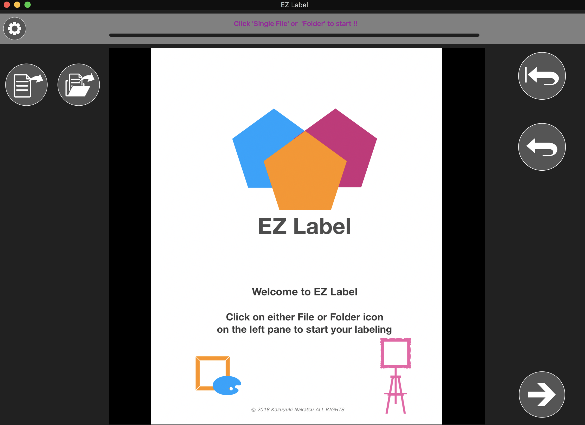

#                          EZ-Labeler

 a MacOS desktop app that annotates rectabgle regions where you click-and-drag-ed and writes the coordinates into a text file per row. This is a demo annotation tool application I used to create a trainning data set for some supervised learning project I have worked for. 

----------

## Abstruct

    Using Xcode with Swift4, 
    this application enables users to annotate the coordinates of rectangular sections.
    that users wish to label. 
----------

    
## what I need to work on more... 

- [ ]   Application delegate to pass data one to another
- [ ]   better UI design 
- [ ]   implement a "goBack" button and its functions that users will be able to work on already saved images
- [ ]   implement some sort of a bar-looking display one's current progress over the total number of images
- [ ]   implement a table view to display the coordinates of rectangular selections a user drew
- [ ]   add capability to write out xml, json and more...

-----

## Environment

    * MacOS development target 10.13.   
    * Xcode Version 9.4.  
    * Swift version 4.1. 
--------
 
